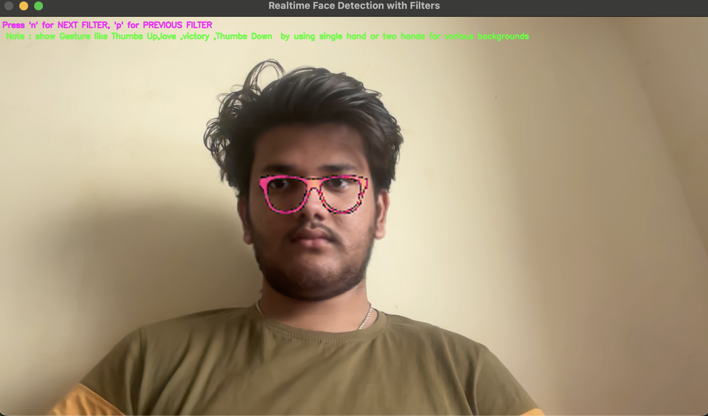
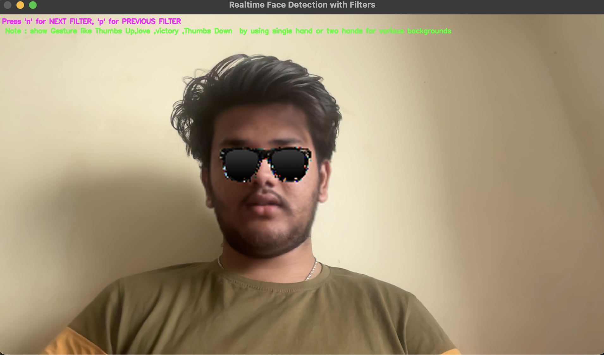
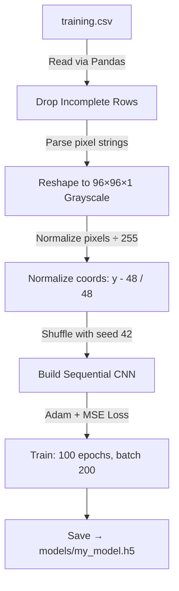
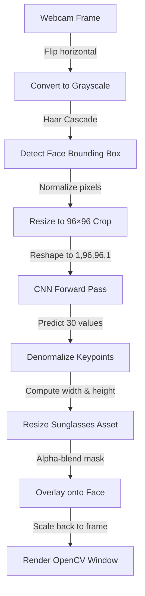

<h1 align="center">😎 Snap Project</h1>

<h3 align="center">Real-Time AR Sunglasses — Powered by Deep Learning</h3>

<p align="center">
  <strong>Train a custom CNN on 15 facial keypoints. Overlay AR sunglasses on your live webcam feed. In real time.</strong>
</p>

<p align="center">
  
  
  
  
  
</p>

<p align="center">
  
  
  
</p>

---

## 🎥 Live Demo

<p align="center">
  
  
</p>

<p align="center"><em>Left: Retro pixel glasses &nbsp;•&nbsp; Right: Classic sunglasses — Press <code>n</code> / <code>p</code> to cycle filters</em></p>

<!-- 💡 Tip: Swap the images above for an animated GIF demo for maximum impact on GitHub -->

---

## 📖 Table of Contents

1. [✨ What This Project Does](#-what-this-project-does)
2. [🚀 Key Features](#-key-features)
3. [📦 Quick Start](#-quick-start)
4. [📂 Project Structure](#-project-structure)
5. [🛠️ Pipeline Architecture](#️-pipeline-architecture)
6. [🧠 CNN Model & Landmarks](#-cnn-model--landmarks)
7. [📐 Math Behind the Magic](#-math-behind-the-magic)
8. [💻 API & Function Reference](#-api--function-reference)
9. [🕶️ AR Overlay Logic](#️-ar-overlay-logic)
10. [⌨️ Keyboard Controls](#️-keyboard-controls)
11. [🔧 Troubleshooting](#-troubleshooting)
12. [🗺️ Roadmap](#️-roadmap)

---

## ✨ What This Project Does

**Snap Project** is a Python computer vision app that brings Snapchat-style face filters to your webcam — no cloud, no API, no subscription.

Here is what happens under the hood, every single frame:

1. **Detect** — Haar Cascade finds your face in the live video stream.
2. **Predict** — A custom-trained CNN predicts 15 facial keypoints from the face crop.
3. **Overlay** — Sunglasses are geometrically scaled and alpha-blended onto your eyes.
4. **Display** — The final frame renders in real time via OpenCV.

All processing runs **locally on your machine**. No data leaves your device.

---

## 🚀 Key Features

- 🎭 **6 Switchable Filters** — Cycle through aviators, classic black, vintage round, retro pixel, and more. All assets are transparent PNGs for clean blending.
- 🧠 **Custom Deep CNN** — A Keras Sequential model trained on the Kaggle Facial Keypoints dataset. Predicts **15 landmarks (30 coordinates)** per frame.
- 📐 **Self-Calibrating Overlay** — Filter width and height are calculated dynamically from eyebrow and nose landmarks. The glasses fit *your* face, not a template.
- 🍏 **macOS Camera Support** — Built-in retry logic and AVFoundation backend handling for macOS permission prompts.
- 🏎️ **Lightweight & Fast** — Only ~218K trainable parameters. Runs smoothly on CPU.
- 📂 **Clean Architecture** — Config, data, training, and inference are fully separated across modules.

---

## 📦 Quick Start

> **Prerequisites:** [Miniconda](https://docs.conda.io/en/latest/miniconda.html) or Python 3.10+

### Step 1 — Set Up Your Environment

```bash
# Create and activate a clean Conda environment
conda create -n snap_project python=3.10 pip -y
conda activate snap_project
```

### Step 2 — Install Dependencies

```bash
pip install --upgrade pip
pip install -r requirements.txt
```

### Step 3 — Prepare the Model

**Option A: Use the pre-trained model** *(recommended)*

Make sure `models/my_model.h5` exists in the repo. You're done — skip to Step 4.

**Option B: Train from scratch**

1. Download the [Kaggle Facial Keypoints Detection dataset](https://www.kaggle.com/c/facial-keypoints-detection/data).
2. Place `training.csv` and `test.csv` inside the `data/` folder.
3. Run the training pipeline:

```bash
python model_builder.py
```

> This trains for 100 epochs (batch size 200, 20% validation split) and saves the model to `models/my_model.h5`.

### Step 4 — Run the App 🕶️

```bash
# Default webcam (index 0)
python shades.py

# External or USB camera (e.g., index 1)
python shades.py 1
```

A window will open showing your mirrored webcam feed with sunglasses overlaid. Press `n` or `p` to switch filters. Press `q` to quit.

---

## 📂 Project Structure

```text
snap_project/
├── cascades/
│   └── haarcascade_frontalface_default.xml  # Haar face detector
├── data/
│   ├── training.csv                         # 7,049 labeled face images + keypoints
│   ├── test.csv                             # 1,783 unlabeled face images
│   ├── IdLookupTable.csv                    # Kaggle variable-to-image mapping
│   └── SampleSubmission.csv                 # Kaggle submission format
├── docs/
│   └── screenshots/
│       ├── image1.png                       # Demo: pixel glasses
│       └── image2.png                       # Demo: classic sunglasses
├── images/
│   ├── sunglasses.png                       # Filter 1 — Classic aviators
│   ├── sunglasses_2.png                     # Filter 2 — Sleek black shades
│   ├── sunglasses_3.jpg                     # Filter 3 — Thick dark glasses
│   ├── sunglasses_4.png                     # Filter 4 — Vintage pink rounds
│   ├── sunglasses_5.jpg                     # Filter 5 — Modern orange frames
│   └── sunglasses_6.png                     # Filter 6 — Retro pixel glasses
├── models/
│   └── my_model.h5                          # Trained Keras CNN weights
├── model_builder.py                         # Training pipeline entry point
├── my_CNN_model.py                          # CNN architecture & compilation
├── paths.py                                 # Central path & asset config
├── requirements.txt                         # Python dependencies
├── shades.py                                # Real-time webcam inference loop
└── utils.py                                 # Data loading & normalization helpers
```

---

## 🛠️ Pipeline Architecture

The app has two distinct phases: **offline training** and **online inference**.

### 1 — Offline Training Pipeline



### 2 — Online Inference & Overlay Pipeline



---

## 🧠 CNN Model & Landmarks

The model takes a **96×96×1 grayscale** face crop and returns **30 floats** — the `(x, y)` coordinates of 15 facial landmarks.

### 🔍 15 Detected Landmarks

| # | Landmark | Coordinates | Notes |
|:---:|:---|:---:|:---|
| 0 | `left_eye_center` | `(x0, y0)` | Left pupil center |
| 1 | `right_eye_center` | `(x1, y1)` | Right pupil center |
| 2 | `left_eye_inner_corner` | `(x2, y2)` | Left eye, nose-side corner |
| 3 | `left_eye_outer_corner` | `(x3, y3)` | Left eye, temple-side corner |
| 4 | `right_eye_inner_corner` | `(x4, y4)` | Right eye, nose-side corner |
| 5 | `right_eye_outer_corner` | `(x5, y5)` | Right eye, temple-side corner |
| 6 | `left_eyebrow_inner_end` | `(x6, y6)` | Left brow, inner start |
| 7 | `left_eyebrow_outer_end` | `(x7, y7)` | Left brow, outer end — **used for glasses width** |
| 8 | `right_eyebrow_inner_end` | `(x8, y8)` | Right brow, inner start — **used for glasses height** |
| 9 | `right_eyebrow_outer_end` | `(x9, y9)` | Right brow, outer end — **anchor for glasses position** |
| 10 | `nose_tip` | `(x10, y10)` | Nose tip — **used for glasses height boundary** |
| 11 | `mouth_left_corner` | `(x11, y11)` | Left mouth corner |
| 12 | `mouth_right_corner` | `(x12, y12)` | Right mouth corner |
| 13 | `mouth_center_top_lip` | `(x13, y13)` | Upper lip center |
| 14 | `mouth_center_bottom_lip` | `(x14, y14)` | Lower lip center |

### 🏗️ Network Architecture

```text
 Layer                        Output Shape        Params
═══════════════════════════════════════════════════════════
 Conv2D (5×5, 32 filters)    (None, 92, 92, 32)      832
 MaxPooling2D (2×2)          (None, 46, 46, 32)        0
─────────────────────────────────────────────────────────
 Conv2D (3×3, 64 filters)    (None, 44, 44, 64)   18,496
 MaxPooling2D (2×2)          (None, 22, 22, 64)        0
 Dropout (0.2)               (None, 22, 22, 64)        0
─────────────────────────────────────────────────────────
 Conv2D (3×3, 128 filters)   (None, 20, 20, 128)  73,856
 MaxPooling2D (2×2)          (None, 10, 10, 128)       0
 Dropout (0.2)               (None, 10, 10, 128)       0
─────────────────────────────────────────────────────────
 Conv2D (3×3, 30 filters)    (None, 8, 8, 30)     34,590
 MaxPooling2D (2×2)          (None, 4, 4, 30)          0
 Dropout (0.2)               (None, 4, 4, 30)          0
─────────────────────────────────────────────────────────
 Flatten                     (None, 480)               0
 Dense (64)                  (None, 64)           30,784
 Dense (128)                 (None, 128)           8,320
 Dense (256)                 (None, 256)          33,024
 Dense (64)                  (None, 64)           16,448
 Dense (30, linear)          (None, 30)            1,950
═══════════════════════════════════════════════════════════
 Total params: 218,300 (~853 KB)
```

**Optimizer:** Adam &nbsp;|&nbsp; **Loss:** Mean Squared Error &nbsp;|&nbsp; **Epochs:** 100 &nbsp;|&nbsp; **Batch size:** 200

---

## 📐 Math Behind the Magic

Three normalization formulas make the model stable across different cameras, lighting, and face sizes.

### Pixel Normalization (Training & Inference)

Converts 8-bit pixel values `[0, 255]` → floating point `[0.0, 1.0]`:

$$X_{\text{norm}} = \frac{X_{\text{pixel}}}{255.0}$$

### Coordinate Normalization (Training Targets)

Centers keypoint coordinates around zero, mapping pixel range `[0, 96]` → `[-1.0, 1.0]`:

$$y_{\text{norm}} = \frac{y_{\text{pixel}} - 48}{48}$$

> Zero-centering the targets helps gradient descent converge faster during training.

### Coordinate Denormalization (Inference)

Reconstructs pixel positions from the model's normalized predictions:

$$y_{\text{pixel}} = (y_{\text{pred}} \times 48) + 48$$

---

## 💻 API & Function Reference

### 🛠️ `paths.py` — Configuration

| Constant | Type | Description |
|:---|:---:|:---|
| `PROJECT_ROOT` | `str` | Absolute path to the project root directory |
| `FILTER_IMAGES` | `list[str]` | Ordered list of active sunglasses asset paths |

---

### 📦 `utils.py` — Data Helpers

#### `load_data(test=False)`

Loads, parses, normalizes, and shuffles the facial keypoints dataset.

| Parameter | Type | Default | Description |
|:---|:---:|:---:|:---|
| `test` | `bool` | `False` | If `True`, loads `test.csv`; otherwise loads `training.csv` |

**Returns:** `X` — image tensor `(N, 96, 96, 1)`, `y` — landmark coordinates `(N, 30)` or `None` for test data.

**Key steps inside:**
1. Reads CSV with `pandas.read_csv`
2. Parses space-delimited pixel strings → NumPy arrays via `np.fromstring`
3. Drops rows with missing landmarks via `dropna()`
4. Reshapes to `(-1, 96, 96, 1)` and normalizes pixels by `÷ 255.0`
5. Shuffles with `sklearn.utils.shuffle(seed=42)` for reproducibility

---

### 🧠 `my_CNN_model.py` — Model Definitions

#### `get_my_CNN_model_architecture()`
Builds and returns the Keras `Sequential` CNN (4 Conv-Pool-Dropout blocks + Dense output).

#### `compile_my_CNN_model(model, optimizer, loss, metrics)`

| Parameter | Type | Description |
|:---|:---:|:---|
| `model` | `Sequential` | The model object to compile |
| `optimizer` | `str` | Optimizer name (e.g., `"adam"`) |
| `loss` | `str` | Loss function (e.g., `"mse"`) |
| `metrics` | `list` | Evaluation metrics list |

#### `train_my_CNN_model(model, X_train, y_train)`
Runs `.fit()` for 100 epochs, batch 200, 20% validation split. Returns Keras `History` object.

#### `save_my_CNN_model(model, fileName)` / `load_my_CNN_model(fileName)`
Serializes and deserializes the model to/from `.h5` format.

---

### 📹 `shades.py` — Webcam Loop

#### `open_webcam(device_index=0, retries=5, retry_delay=2.0)`

Cross-platform webcam initializer with macOS AVFoundation support.

| Parameter | Type | Default | Description |
|:---|:---:|:---:|:---|
| `device_index` | `int` | `0` | Camera device index |
| `retries` | `int` | `5` | Max retry attempts |
| `retry_delay` | `float` | `2.0` | Seconds between retries |

**Returns:** Active `cv2.VideoCapture` object, or `None` if all retries fail.

#### `_camera_help_message()`
Returns OS-specific instructions for fixing camera permission issues.

---

## 🕶️ AR Overlay Logic

The sunglasses position and size are computed dynamically from 4 landmark points — so they fit any face, any distance from the camera.

**Top-left anchor** — placed at `points[9]` (`right_eyebrow_outer_end`):

$$x_{\text{start}} = x_9, \quad y_{\text{start}} = y_9$$

**Dynamic width** — horizontal span of outer eyebrow tips, expanded by 10%:

$$\text{width} = \lfloor (x_7 - x_9) \times 1.1 \rfloor$$

**Dynamic height** — vertical span from right eyebrow to nose tip, scaled down by 10%:

$$\text{height} = \left\lfloor \frac{y_{10} - y_8}{1.1} \right\rfloor$$

### 🎨 Alpha-Blending

Transparent pixels are masked out using a boolean array before blending:

```python
# Build a mask: True where the sunglasses image is non-black (non-transparent)
transparent_region = sunglass_resized[:, :, :3] != 0

# Apply only the visible pixels onto the face region
face_resized_color[y_start:y_end, x_start:x_end][transparent_region] = \
    sunglass_resized[:, :, :3][transparent_region]
```

---

## ⌨️ Keyboard Controls

Focus the OpenCV window, then use:

| Key | Action | Description |
|:---:|:---|:---|
| `n` | **Next filter** | Cycle forward through sunglasses assets |
| `p` | **Previous filter** | Cycle backward through sunglasses assets |
| `q` | **Quit** | Release camera and close the window |

---

## 🔧 Troubleshooting

| Symptom | Root Cause | Fix |
|:---|:---|:---|
| `AttributeError: module 'keras' has no attribute...` | TF 2.16+ has breaking Keras API changes | Downgrade: `pip install "tensorflow>=2.10.0,<2.16.0"` |
| `FileNotFoundError: models/my_model.h5` | Model weights not generated yet | Run `python model_builder.py` first |
| macOS: App freezes or exits immediately | AVFoundation camera permission denied | Go to **System Settings → Privacy & Security → Camera** → enable access for Terminal or your IDE → restart and retry |
| `ImportError: libGL.so.1` (Linux / Docker) | Missing OpenGL system library | Run `sudo apt-get install -y libgl1-mesa-glx` |
| Glasses are misaligned or drifting | Poor lighting or unstable face detection | Improve ambient lighting; in `shades.py`, increase `minNeighbors` in `detectMultiScale` |

---

## 🗺️ Roadmap

Ideas for taking this project further:

- 🌟 **MediaPipe Face Mesh** — Replace Haar + custom CNN with MediaPipe's 468-point mesh for better rotation stability and smoother tracking.
- 🖐️ **Gesture Controls** — Use MediaPipe Hands to swap filters with real gestures (thumbs up, peace sign).
- 🎩 **More AR Accessories** — Extend the overlay system to support hats, earrings, nose rings, and 3D masks using rotation matrices.
- 📱 **Mobile Port** — Package the pipeline for Android or iOS using TensorFlow Lite.
- 🎛️ **GUI Control Panel** — Add a simple Tkinter or web UI for filter selection and camera switching.

---

<p align="center">
  <strong>Train once. Filter forever.</strong><br/>
  <em>Press <code>n</code>, pick your shades, and smile. 😎</em><br/><br/>
  <em>Contributions are welcome — open an issue or submit a PR!</em>
<<<<<<< HEAD
</p>
=======
</p>
>>>>>>> 61b68c7 (first commit)
